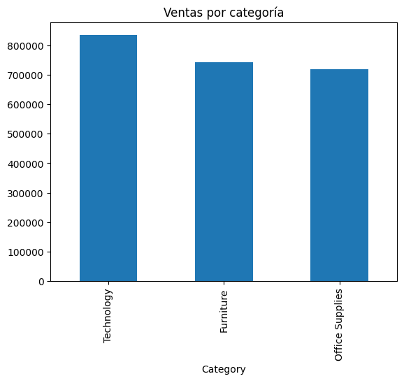
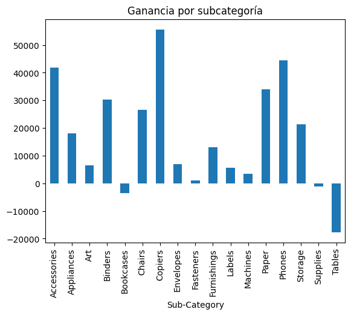
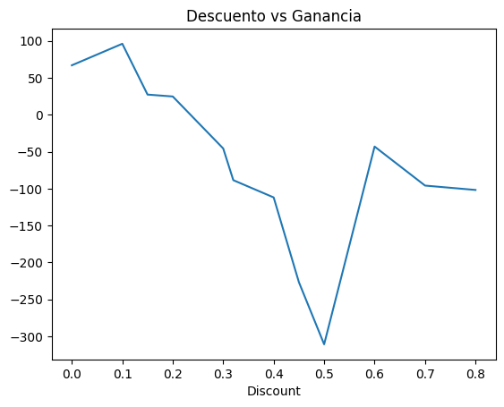

 Análisis de Ventas - Superstore

 Objetivo

Analizar el rendimiento de ventas y rentabilidad de una tienda para identificar oportunidades de mejora y toma de decisiones estratégicas.

 Dataset

Dataset de ventas con información de productos, categorías, regiones, descuentos y ganancias.

Limpieza de datos

* Eliminación de duplicados
* Verificación de valores nulos
* Estandarización de columnas

Análisis realizado

 1. Ventas por categoría

Se identificó que la categoría Technology lidera en ventas.

 2. Rentabilidad por categoría

Technology también genera la mayor ganancia.

 3. Subcategorías con pérdidas

Se detectaron pérdidas en:

* Tables
* Bookcases
* Supplies

 4. Impacto del descuento

Descuentos mayores al 30% generan pérdidas consistentes.

Visualizaciones

VENTAS POR CATEGORIA

GANANCIAS POR SUBCATEGORIA

DESCUENTO VS GANANCIA

Conclusiones

* Technology es el principal motor del negocio.
* Algunas subcategorías generan pérdidas y deben ser revisadas.
* Los descuentos altos afectan negativamente la rentabilidad.

Recomendaciones

* Reducir descuentos mayores al 30%
* Revisar costos en productos con pérdidas
* Enfocar estrategias en productos más rentables

Herramientas utilizadas

* Python (pandas, matplotlib)
* Jupyter Notebook

Insights clave
-La categoría Technology lidera tanto en ventas como en rentabilidad, siendo el principal motor del negocio.
-Subcategorías como Tables y Bookcases generan pérdidas significativas a pesar de tener ventas.
-Existe una relación negativa entre el descuento y la ganancia: descuentos mayores al 30% generan pérdidas.
-Productos como Copiers y Phones destacan como los más rentables.
